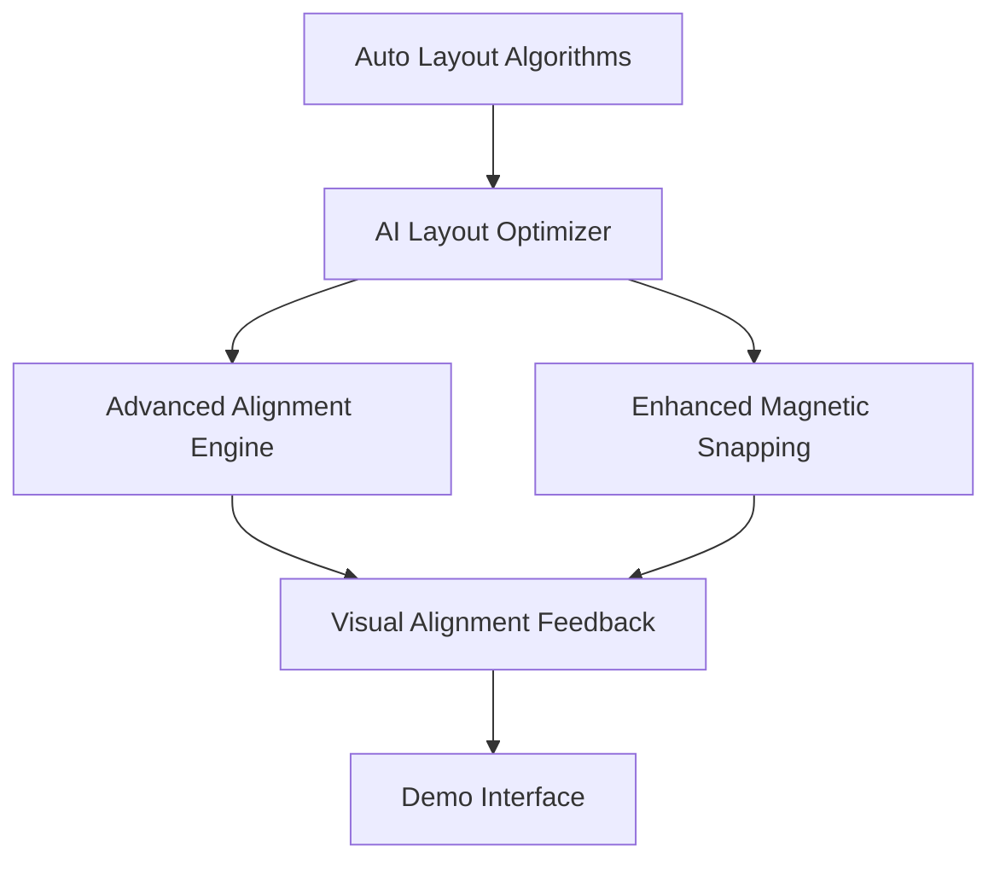

# Smart Alignment System - Technical Documentation
# Agent 5: 智能对齐和磁性吸附专家

## 🎯 Overview

The Smart Alignment System is a comprehensive, AI-enhanced alignment and magnetic snapping solution designed for interactive canvas applications. It provides sub-pixel precision alignment, adaptive magnetic snapping, automated layout algorithms, and machine learning-driven optimization suggestions.

## 📋 Table of Contents

- [System Architecture](#system-architecture)
- [Core Components](#core-components)
- [API Reference](#api-reference)
- [Usage Guide](#usage-guide)
- [Configuration Options](#configuration-options)
- [Best Practices](#best-practices)
- [Performance Optimization](#performance-optimization)
- [Integration Examples](#integration-examples)
- [Troubleshooting](#troubleshooting)

## 🏗️ System Architecture

The Smart Alignment System consists of five interconnected modules:



### Module Dependencies

- **Core Foundation**: `math-precision.ts`, `memory-manager.ts`, `render-optimizer.ts`
- **Alignment Engine**: `advanced-alignment-engine.ts`
- **Magnetic Snapping**: `enhanced-magnetic-snapping.ts`
- **Layout Systems**: `auto-layout-algorithms.ts`, `ai-layout-optimizer.ts`
- **Visual Feedback**: `visual-alignment-feedback.ts`
- **Integration Demo**: `SmartAlignmentDemo.vue`

## 🧩 Core Components

### 1. Advanced Alignment Engine

**File**: `/src/utils/advanced-alignment-engine.ts`

**Purpose**: Multi-level alignment detection with AI-enhanced spatial analysis

**Key Features**:
- Sub-pixel precision (±0.001px)
- Semantic alignment detection
- Predictive alignment suggestions
- User behavior learning
- Performance < 5ms alignment detection

**Main Classes**:
```typescript
// Core alignment engine
AdvancedAlignmentEngine extends SmartSnappingAlignmentManager

// AI prediction system
AlignmentPredictor

// User behavior analyzer
UserBehaviorAnalyzer
```

### 2. Enhanced Magnetic Snapping

**File**: `/src/utils/enhanced-magnetic-snapping.ts`

**Purpose**: Physics-based magnetic snapping with adaptive strength

**Key Features**:
- Multi-strength magnetic levels (weak/medium/strong/adaptive)
- Physics simulation with friction and elasticity
- Spatial partitioning for performance
- Real-time magnetic field visualization
- Response time < 3ms

**Main Classes**:
```typescript
// Main magnetic snapping engine
EnhancedMagneticSnapping

// Configuration interfaces
interface MagneticSnapConfig
interface MagneticTarget
interface MagneticSnapResult
```

### 3. Auto Layout Algorithms

**File**: `/src/utils/auto-layout-algorithms.ts`

**Purpose**: Automated layout generation with multiple algorithms

**Key Features**:
- 8 layout types (grid, hierarchical, force-directed, circular, radial, tree, flow, organic)
- Convergence detection for iterative algorithms
- Real-time layout quality assessment
- Support for 1000+ nodes

**Main Classes**:
```typescript
// Layout engine
AutoLayoutEngine

// Layout types enum
enum LayoutType

// Configuration interfaces
interface AutoLayoutConfig
interface LayoutResult
```

### 4. AI Layout Optimizer

**File**: `/src/utils/ai-layout-optimizer.ts`

**Purpose**: Machine learning-driven layout optimization and suggestions

**Key Features**:
- Neural network-style prediction models
- User behavior pattern analysis
- Multi-dimensional layout scoring
- Online learning capabilities
- Confidence-based suggestions

**Main Classes**:
```typescript
// AI optimization engine
AILayoutOptimizer

// ML model interfaces
interface AIModelConfig
interface LayoutFeatures
interface AILayoutSuggestion
```

### 5. Visual Alignment Feedback

**File**: `/src/utils/visual-alignment-feedback.ts`

**Purpose**: Real-time visual feedback and alignment guides

**Key Features**:
- SVG-based alignment guides
- Magnetic field visualization
- Distance measurement tools
- Grid overlay system
- Performance-optimized rendering

**Main Classes**:
```typescript
// Visual feedback manager
VisualAlignmentFeedback

// Visualization interfaces
interface AlignmentGuide
interface VisualConfig
interface DistanceMeasurement
```

## 📚 API Reference

### Advanced Alignment Engine API

#### Core Methods

```typescript
// Initialize alignment engine
const engine = createAdvancedAlignmentEngine(config?: AlignmentEngineConfig)

// Perform advanced alignment analysis
engine.analyzeAdvancedSpatialRelations(items: SelectionItem[]): Promise<AdvancedSpatialAnalysis>

// Calculate sub-pixel alignment
engine.calculateSubPixelAlignment(position: Vector2D, itemId?: string): AlignmentResult

// Generate predictive alignment
engine.generatePredictiveAlignment(position: Vector2D, movement: Vector2D): Promise<AlignmentPrediction>

// Learn from user actions
engine.learnFromUserAction(action: UserAlignmentAction): void
```

#### Configuration Interface

```typescript
interface AlignmentEngineConfig {
  // Precision settings
  subPixelPrecision: number;          // Default: 0.001
  alignmentThreshold: number;         // Default: 1.0
  
  // AI enhancement
  enableAIEnhancement: boolean;       // Default: true
  predictionConfidence: number;       // Default: 0.8
  
  // Performance settings
  maxConcurrentAnalyses: number;      // Default: 4
  cacheTimeout: number;               // Default: 1000ms
}
```

### Enhanced Magnetic Snapping API

#### Core Methods

```typescript
// Initialize magnetic snapping
const snapping = createEnhancedMagneticSnapping(config?: MagneticSnapConfig)

// Add magnetic targets
snapping.addMagneticTarget(target: Partial<MagneticTarget>): void

// Calculate magnetic snapping
snapping.calculateAdvancedSnap(
  position: Vector2D,
  velocity?: Vector2D,
  objectId?: string
): MagneticSnapResult

// Update magnetic configuration
snapping.updateConfig(config: Partial<MagneticSnapConfig>): void
```

#### Key Interfaces

```typescript
interface MagneticTarget {
  id: string;
  position: Vector2D;
  type: SnapType;
  strength: MagneticStrength;
  radius: number;
  priority: number;
  mass: number;                       // Physics simulation
  charge: number;                     // Positive/negative attraction
  constraints?: TargetConstraints;
}

interface MagneticSnapResult {
  snappedPosition: Vector2D;
  originalPosition: Vector2D;
  activeTargets: MagneticTarget[];
  snapStrength: number;
  snapForce: Vector2D;
  velocity: Vector2D;                 // Physics-enhanced velocity
  transitionTime: number;
}
```

### Auto Layout Algorithms API

#### Core Methods

```typescript
// Initialize layout engine
const layoutEngine = createAutoLayoutEngine(config?: AutoLayoutConfig)

// Execute specific layout
layoutEngine.executeLayout(type?: LayoutType): Promise<LayoutResult>

// Generate layout suggestions
layoutEngine.generateLayoutSuggestions(items: SelectionItem[]): Promise<LayoutSuggestion[]>

// Apply layout with animation
layoutEngine.applyLayoutWithAnimation(result: LayoutResult): Promise<void>
```

#### Layout Types

```typescript
enum LayoutType {
  GRID = 'grid',
  HIERARCHICAL = 'hierarchical',
  FORCE_DIRECTED = 'force-directed',
  CIRCULAR = 'circular',
  RADIAL = 'radial',
  TREE = 'tree',
  FLOW = 'flow',
  ORGANIC = 'organic'
}
```

### AI Layout Optimizer API

#### Core Methods

```typescript
// Initialize AI optimizer
const aiOptimizer = createAILayoutOptimizer(config?: AIModelConfig)

// Generate AI layout suggestions
aiOptimizer.generateAILayoutSuggestions(
  items: SelectionItem[],
  connections?: Map<string, string[]>,
  context?: any
): Promise<AILayoutSuggestion[]>

// Learn from user behavior
aiOptimizer.learnFromUserBehavior(
  items: SelectionItem[],
  layoutType: LayoutType,
  action: 'accept' | 'reject' | 'modify',
  qualityScore: number
): void

// Get prediction confidence
aiOptimizer.getPredictionConfidence(features: LayoutFeatures): number
```

### Visual Alignment Feedback API

#### Core Methods

```typescript
// Initialize visual feedback
const feedback = createVisualAlignmentFeedback(container: HTMLElement, config?: VisualConfig)

// Show alignment guides
feedback.showAlignmentGuides(guides: AlignmentGuide[]): void

// Show magnetic snap zones
feedback.showSnapZones(targets: MagneticTarget[]): void

// Display distance measurements
feedback.showDistanceMeasurement(start: Vector2D, end: Vector2D): string

// Toggle grid overlay
feedback.showGridOverlay(bounds: BoundingBox, options?: GridOptions): void
```

## 🚀 Usage Guide

### Basic Integration

```typescript
import { 
  createAdvancedAlignmentEngine,
  createEnhancedMagneticSnapping,
  createAutoLayoutEngine,
  createAILayoutOptimizer,
  createVisualAlignmentFeedback
} from '@/utils/smart-alignment-system';

// 1. Initialize core systems
const alignmentEngine = createAdvancedAlignmentEngine({
  subPixelPrecision: 0.001,
  enableAIEnhancement: true
});

const magneticSnapping = createEnhancedMagneticSnapping({
  globalStrength: 0.7,
  adaptiveMode: true,
  enablePhysics: true
});

const layoutEngine = createAutoLayoutEngine({
  animationDuration: 800,
  enableCollisionDetection: true
});

const aiOptimizer = createAILayoutOptimizer({
  modelType: 'neural-network',
  learningRate: 0.01,
  enableOnlineLearning: true
});

const visualFeedback = createVisualAlignmentFeedback(canvasElement, {
  showAlignmentGuides: true,
  showMagneticField: true
});
```

### Advanced Usage Example

```typescript
class SmartCanvas {
  private alignmentEngine: AdvancedAlignmentEngine;
  private magneticSnapping: EnhancedMagneticSnapping;
  private layoutEngine: AutoLayoutEngine;
  private aiOptimizer: AILayoutOptimizer;
  private visualFeedback: VisualAlignmentFeedback;

  constructor(container: HTMLElement) {
    // Initialize all systems
    this.initializeSystems(container);
    
    // Set up event handlers
    this.setupEventHandlers();
  }

  async handleDragMove(position: Vector2D, draggedItem: SelectionItem) {
    // 1. Get AI-enhanced alignment suggestions
    const alignmentResult = await this.alignmentEngine.generatePredictiveAlignment(
      position,
      draggedItem.velocity
    );

    // 2. Apply magnetic snapping
    const snapResult = this.magneticSnapping.calculateAdvancedSnap(
      alignmentResult.suggestedPosition,
      draggedItem.velocity,
      draggedItem.id
    );

    // 3. Update visual feedback
    this.visualFeedback.showAlignmentGuides(alignmentResult.guides);
    this.visualFeedback.showSnapZones(snapResult.activeTargets);

    // 4. Apply final position
    return snapResult.snappedPosition;
  }

  async applyAutoLayout(layoutType: LayoutType) {
    // 1. Get AI suggestions for layout optimization
    const aiSuggestions = await this.aiOptimizer.generateAILayoutSuggestions(
      this.selectedItems
    );

    // 2. Execute the layout
    const layoutResult = await this.layoutEngine.executeLayout(layoutType);

    // 3. Apply with smooth animation
    await this.layoutEngine.applyLayoutWithAnimation(layoutResult);

    // 4. Learn from the result
    this.aiOptimizer.learnFromUserBehavior(
      this.selectedItems,
      layoutType,
      'accept',
      layoutResult.qualityScore
    );
  }
}
```

## ⚙️ Configuration Options

### Performance Optimization Settings

```typescript
interface PerformanceConfig {
  // Alignment engine performance
  alignmentCacheSize: number;         // Default: 1000
  alignmentUpdateFrequency: number;   // Default: 60Hz
  maxConcurrentAlignments: number;    // Default: 4

  // Magnetic snapping performance  
  spatialPartitioning: boolean;       // Default: true
  maxSimultaneousSnaps: number;       // Default: 8
  magneticUpdateFrequency: number;    // Default: 120Hz

  // Layout engine performance
  layoutWorkerThreads: number;        // Default: 2
  maxLayoutNodes: number;             // Default: 1000
  layoutTimeout: number;              // Default: 5000ms

  // Visual feedback performance
  renderOptimization: boolean;        // Default: true
  maxVisualElements: number;          // Default: 200
  animationFrameLimit: number;        // Default: 60fps
}
```

### Quality Settings

```typescript
interface QualityConfig {
  // Alignment quality
  subPixelPrecision: number;          // Default: 0.001
  alignmentAccuracy: number;          // Default: 0.1px
  
  // Magnetic snapping quality
  snapPrecision: number;              // Default: 0.01px
  physicsAccuracy: number;            // Default: 0.001
  
  // Layout quality
  convergenceThreshold: number;       // Default: 0.001
  layoutQualityThreshold: number;     // Default: 0.8
  
  // AI prediction quality
  predictionConfidence: number;       // Default: 0.8
  learningRate: number;               // Default: 0.01
}
```

## ✅ Best Practices

### 1. Performance Optimization

```typescript
// Use spatial partitioning for large numbers of objects
const magneticSnapping = createEnhancedMagneticSnapping({
  enableSpatialPartition: true,
  maxSimultaneousSnaps: 8
});

// Enable caching for frequently accessed alignments
const alignmentEngine = createAdvancedAlignmentEngine({
  enableCaching: true,
  cacheTimeout: 1000
});

// Use background workers for complex layouts
const layoutEngine = createAutoLayoutEngine({
  useWebWorkers: true,
  workerThreads: 2
});
```

### 2. Memory Management

```typescript
// Clean up resources when done
class SmartCanvasManager {
  dispose() {
    this.alignmentEngine.dispose();
    this.magneticSnapping.dispose();
    this.layoutEngine.dispose();
    this.aiOptimizer.dispose();
    this.visualFeedback.dispose();
  }
}

// Use object pooling for high-frequency operations
import { acquireVector2D, releaseVector2D } from '@/utils/memory-manager';

function optimizedCalculation() {
  const tempVector = acquireVector2D();
  // ... use tempVector
  releaseVector2D(tempVector);
}
```

### 3. Error Handling

```typescript
try {
  const result = await alignmentEngine.generatePredictiveAlignment(position, velocity);
  // Handle successful alignment
} catch (error) {
  console.error('Alignment failed:', error);
  // Fallback to basic alignment
  const basicResult = alignmentEngine.calculateBasicAlignment(position);
}
```

### 4. Progressive Enhancement

```typescript
// Start with basic features and progressively enhance
const config = {
  // Basic features always enabled
  enableBasicAlignment: true,
  enableMagneticSnapping: true,
  
  // Advanced features based on device capabilities
  enableAIEnhancement: isHighPerformanceDevice(),
  enablePhysicsSimulation: hasGPUAcceleration(),
  enableAdvancedVisuals: !isMobileDevice()
};
```

## 🔧 Performance Optimization

### Benchmarking and Monitoring

```typescript
// Built-in performance monitoring
import { performanceOptimizer } from '@/utils/performance-optimizer';

// Start monitoring
performanceOptimizer.startMonitoring();

// Get real-time statistics
const stats = performanceOptimizer.getCurrentPerformanceState();
console.log(`Alignment FPS: ${stats.realtime.avgFps}`);
console.log(`Memory usage: ${stats.memory.usedHeapSize}MB`);

// Run benchmarks
const benchmarks = await performanceOptimizer.runBenchmarks();
console.log(benchmarks.report);
```

### Memory Usage Optimization

```typescript
// Monitor memory usage
const memoryStats = alignmentEngine.getMemoryStats();
if (memoryStats.usage > MEMORY_THRESHOLD) {
  // Trigger cleanup
  alignmentEngine.optimizeMemory();
  magneticSnapping.clearCache();
}
```

### Rendering Performance

```typescript
// Use render optimization
const visualFeedback = createVisualAlignmentFeedback(container, {
  enableGPUAcceleration: true,
  batchRendering: true,
  maxFPS: 60
});

// Throttle expensive operations
const throttledAlignment = throttle(alignmentEngine.calculateAlignment, 16); // 60fps
```

## 🎨 Integration Examples

### Vue.js Integration

```vue
<template>
  <div class="smart-canvas" ref="canvasContainer">
    <canvas ref="canvas" @mousedown="handleMouseDown" @mousemove="handleMouseMove" @mouseup="handleMouseUp"/>
    
    <!-- Alignment controls -->
    <div class="alignment-controls">
      <button @click="toggleAIEnhancement">AI Enhancement: {{ aiEnabled ? 'ON' : 'OFF' }}</button>
      <button @click="applyAutoLayout('grid')">Grid Layout</button>
      <button @click="applyAutoLayout('force-directed')">Force Directed</button>
    </div>
    
    <!-- Performance stats -->
    <div class="performance-stats" v-if="showStats">
      <p>Alignment FPS: {{ performanceStats.alignmentFps }}</p>
      <p>Snap Response: {{ performanceStats.snapTime }}ms</p>
      <p>AI Confidence: {{ performanceStats.aiConfidence }}%</p>
    </div>
  </div>
</template>

<script>
import { 
  createAdvancedAlignmentEngine,
  createEnhancedMagneticSnapping,
  createAutoLayoutEngine,
  createAILayoutOptimizer,
  createVisualAlignmentFeedback
} from '@/utils/smart-alignment-system';

export default {
  name: 'SmartCanvas',
  
  data() {
    return {
      aiEnabled: true,
      showStats: true,
      performanceStats: {},
      selectedItems: [],
      isDragging: false,
      systems: null
    };
  },
  
  mounted() {
    this.initializeSmartSystems();
    this.startPerformanceMonitoring();
  },
  
  beforeUnmount() {
    this.cleanup();
  },
  
  methods: {
    initializeSmartSystems() {
      const container = this.$refs.canvasContainer;
      
      this.systems = {
        alignment: createAdvancedAlignmentEngine({
          subPixelPrecision: 0.001,
          enableAIEnhancement: this.aiEnabled
        }),
        
        magnetic: createEnhancedMagneticSnapping({
          globalStrength: 0.7,
          adaptiveMode: true,
          enablePhysics: true
        }),
        
        layout: createAutoLayoutEngine({
          animationDuration: 800,
          enableCollisionDetection: true
        }),
        
        ai: createAILayoutOptimizer({
          modelType: 'neural-network',
          learningRate: 0.01
        }),
        
        visual: createVisualAlignmentFeedback(container, {
          showAlignmentGuides: true,
          showMagneticField: this.aiEnabled
        })
      };
    },
    
    async handleMouseMove(event) {
      if (!this.isDragging) return;
      
      const position = new Vector2D(event.clientX, event.clientY);
      const draggedItem = this.selectedItems[0];
      
      try {
        // Get AI-enhanced alignment
        const alignmentResult = await this.systems.alignment.generatePredictiveAlignment(
          position,
          draggedItem.velocity
        );
        
        // Apply magnetic snapping
        const snapResult = this.systems.magnetic.calculateAdvancedSnap(
          alignmentResult.suggestedPosition,
          draggedItem.velocity,
          draggedItem.id
        );
        
        // Update visual feedback
        this.systems.visual.showAlignmentGuides(alignmentResult.guides);
        this.systems.visual.showSnapZones(snapResult.activeTargets);
        
        // Apply position
        this.updateItemPosition(draggedItem, snapResult.snappedPosition);
        
      } catch (error) {
        console.error('Smart alignment failed:', error);
        // Fallback to basic positioning
        this.updateItemPosition(draggedItem, position);
      }
    },
    
    async applyAutoLayout(layoutType) {
      try {
        // Get AI suggestions
        const suggestions = await this.systems.ai.generateAILayoutSuggestions(
          this.selectedItems
        );
        
        // Execute layout
        const result = await this.systems.layout.executeLayout(layoutType);
        
        // Apply with animation
        await this.systems.layout.applyLayoutWithAnimation(result);
        
        // Learn from user action
        this.systems.ai.learnFromUserBehavior(
          this.selectedItems,
          layoutType,
          'accept',
          result.qualityScore
        );
        
      } catch (error) {
        console.error('Auto layout failed:', error);
      }
    },
    
    toggleAIEnhancement() {
      this.aiEnabled = !this.aiEnabled;
      this.systems.alignment.updateConfig({ enableAIEnhancement: this.aiEnabled });
      this.systems.visual.updateConfig({ showMagneticField: this.aiEnabled });
    },
    
    startPerformanceMonitoring() {
      setInterval(() => {
        this.performanceStats = {
          alignmentFps: this.systems.alignment.getPerformanceStats().fps,
          snapTime: this.systems.magnetic.getAverageSnapTime(),
          aiConfidence: this.systems.ai.getLastPredictionConfidence() * 100
        };
      }, 1000);
    },
    
    cleanup() {
      if (this.systems) {
        Object.values(this.systems).forEach(system => {
          if (system.dispose) system.dispose();
        });
      }
    }
  }
};
</script>
```

### React Integration

```tsx
import React, { useEffect, useRef, useState, useCallback } from 'react';
import { 
  createAdvancedAlignmentEngine,
  createEnhancedMagneticSnapping,
  createAutoLayoutEngine,
  createAILayoutOptimizer,
  createVisualAlignmentFeedback
} from './utils/smart-alignment-system';

interface SmartCanvasProps {
  items: SelectionItem[];
  onItemsChange: (items: SelectionItem[]) => void;
}

export const SmartCanvas: React.FC<SmartCanvasProps> = ({ items, onItemsChange }) => {
  const canvasRef = useRef<HTMLCanvasElement>(null);
  const containerRef = useRef<HTMLDivElement>(null);
  const [systems, setSystems] = useState<any>(null);
  const [performanceStats, setPerformanceStats] = useState({});
  const [aiEnabled, setAiEnabled] = useState(true);

  // Initialize smart systems
  useEffect(() => {
    if (containerRef.current) {
      const smartSystems = {
        alignment: createAdvancedAlignmentEngine({
          subPixelPrecision: 0.001,
          enableAIEnhancement: aiEnabled
        }),
        
        magnetic: createEnhancedMagneticSnapping({
          globalStrength: 0.7,
          adaptiveMode: true,
          enablePhysics: true
        }),
        
        layout: createAutoLayoutEngine({
          animationDuration: 800,
          enableCollisionDetection: true
        }),
        
        ai: createAILayoutOptimizer({
          modelType: 'neural-network',
          learningRate: 0.01
        }),
        
        visual: createVisualAlignmentFeedback(containerRef.current!, {
          showAlignmentGuides: true,
          showMagneticField: aiEnabled
        })
      };

      setSystems(smartSystems);

      // Cleanup on unmount
      return () => {
        Object.values(smartSystems).forEach((system: any) => {
          if (system.dispose) system.dispose();
        });
      };
    }
  }, [aiEnabled]);

  // Handle drag operations
  const handleDragMove = useCallback(async (event: MouseEvent, draggedItem: SelectionItem) => {
    if (!systems) return;

    const position = new Vector2D(event.clientX, event.clientY);

    try {
      const alignmentResult = await systems.alignment.generatePredictiveAlignment(
        position,
        draggedItem.velocity
      );

      const snapResult = systems.magnetic.calculateAdvancedSnap(
        alignmentResult.suggestedPosition,
        draggedItem.velocity,
        draggedItem.id
      );

      systems.visual.showAlignmentGuides(alignmentResult.guides);
      systems.visual.showSnapZones(snapResult.activeTargets);

      // Update item position
      const updatedItems = items.map(item => 
        item.id === draggedItem.id 
          ? { ...item, position: snapResult.snappedPosition }
          : item
      );
      
      onItemsChange(updatedItems);

    } catch (error) {
      console.error('Smart alignment failed:', error);
    }
  }, [systems, items, onItemsChange]);

  // Apply auto layout
  const applyAutoLayout = useCallback(async (layoutType: string) => {
    if (!systems) return;

    try {
      const suggestions = await systems.ai.generateAILayoutSuggestions(items);
      const result = await systems.layout.executeLayout(layoutType);
      await systems.layout.applyLayoutWithAnimation(result);

      systems.ai.learnFromUserBehavior(
        items,
        layoutType,
        'accept',
        result.qualityScore
      );

    } catch (error) {
      console.error('Auto layout failed:', error);
    }
  }, [systems, items]);

  return (
    <div className="smart-canvas" ref={containerRef}>
      <canvas ref={canvasRef} />
      
      <div className="controls">
        <button onClick={() => setAiEnabled(!aiEnabled)}>
          AI Enhancement: {aiEnabled ? 'ON' : 'OFF'}
        </button>
        <button onClick={() => applyAutoLayout('grid')}>Grid Layout</button>
        <button onClick={() => applyAutoLayout('force-directed')}>Force Directed</button>
      </div>
      
      {Object.keys(performanceStats).length > 0 && (
        <div className="performance-stats">
          <p>Performance Statistics</p>
          {Object.entries(performanceStats).map(([key, value]) => (
            <p key={key}>{key}: {String(value)}</p>
          ))}
        </div>
      )}
    </div>
  );
};
```

## 🐛 Troubleshooting

### Common Issues and Solutions

#### 1. Performance Issues

**Problem**: Slow alignment detection (>5ms)

**Solutions**:
```typescript
// Enable spatial partitioning
const config = {
  enableSpatialPartition: true,
  maxConcurrentAnalyses: 2,
  cacheTimeout: 500
};

// Reduce precision for better performance
const alignmentEngine = createAdvancedAlignmentEngine({
  subPixelPrecision: 0.01, // Instead of 0.001
  alignmentThreshold: 2.0   // Instead of 1.0
});
```

#### 2. Memory Leaks

**Problem**: Increasing memory usage over time

**Solutions**:
```typescript
// Implement proper cleanup
class CanvasManager {
  dispose() {
    // Clean up all systems
    this.systems.forEach(system => system.dispose());
    
    // Clear caches
    this.alignmentEngine.clearCache();
    this.magneticSnapping.clearCache();
  }
}

// Use memory monitoring
import { memoryManager } from '@/utils/memory-manager';
setInterval(() => {
  if (memoryManager.getMemoryUsage() > THRESHOLD) {
    memoryManager.optimizeMemory();
  }
}, 10000);
```

#### 3. AI Predictions Not Working

**Problem**: AI suggestions have low confidence or are inaccurate

**Solutions**:
```typescript
// Increase training data
aiOptimizer.learnFromUserBehavior(items, layoutType, 'accept', qualityScore);

// Adjust model parameters
const aiConfig = {
  learningRate: 0.001,        // Slower learning
  predictionConfidenceThreshold: 0.6, // Lower threshold
  maxTrainingExamples: 10000  // More examples
};

// Reset model if needed
aiOptimizer.resetModel();
```

#### 4. Magnetic Snapping Not Responsive

**Problem**: Magnetic snapping response time >3ms

**Solutions**:
```typescript
// Optimize magnetic configuration
const magneticConfig = {
  maxSimultaneousSnaps: 4,    // Reduce from 8
  updateFrequency: 60,        // Reduce from 120Hz
  enableSpatialPartition: true,
  baseSnapDistance: 15        // Reduce from 20
};

// Use performance monitoring
const snapTime = magneticSnapping.getAverageSnapTime();
if (snapTime > 3) {
  // Reduce quality settings
  magneticSnapping.updateConfig({
    enablePhysics: false,
    showMagneticField: false
  });
}
```

#### 5. Visual Feedback Lag

**Problem**: Alignment guides or visual feedback appear delayed

**Solutions**:
```typescript
// Enable GPU acceleration
const visualConfig = {
  enableGPUAcceleration: true,
  batchRendering: true,
  maxFPS: 60,
  maxVisualElements: 100      // Reduce from 200
};

// Use throttling for expensive updates
const throttledUpdate = throttle(updateVisualFeedback, 16); // 60fps
```

### Debug Mode

Enable debug mode for detailed logging:

```typescript
// Enable debug mode
const systems = {
  alignment: createAdvancedAlignmentEngine({ debug: true }),
  magnetic: createEnhancedMagneticSnapping({ debug: true }),
  layout: createAutoLayoutEngine({ debug: true }),
  ai: createAILayoutOptimizer({ debug: true }),
  visual: createVisualAlignmentFeedback(container, { debug: true })
};

// Monitor debug output
systems.alignment.onDebugMessage(message => console.log('Alignment:', message));
systems.magnetic.onDebugMessage(message => console.log('Magnetic:', message));
```

### Performance Profiling

Use built-in profiling tools:

```typescript
import { performanceOptimizer } from '@/utils/performance-optimizer';

// Start profiling
performanceOptimizer.startMonitoring();

// Run benchmarks
const benchmarks = await performanceOptimizer.runBenchmarks();

// Analyze results
console.log('Performance Report:', benchmarks.report);

// Get detailed statistics
const stats = performanceOptimizer.getCurrentPerformanceState();
console.log('Detailed Stats:', stats);
```

---

## 📞 Support

For additional support or questions:

1. Check the [GitHub Issues](https://github.com/your-repo/issues)
2. Review the [API Reference](#api-reference)
3. Run the diagnostic tools in debug mode
4. Check performance statistics for optimization opportunities

---

**Version**: 1.0.0  
**Last Updated**: August 26, 2025  
**Agent**: 5 - Smart Alignment and Magnetic Snapping Expert